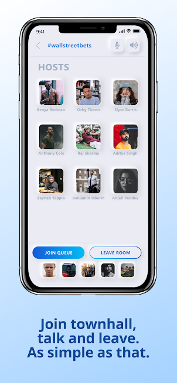

# Keplr
Keplr is an Audio rooms cross native app built with React Native. 

Built to be used by farmers who were protesting against newly released farm bills in the state of Punjab,India. The app although primarily built for them as they had trouble making their voice reach out to others in realtime in an easy manner, quickly started reaching out to the aunties and uncles of my community via whatsapp groups as they had an easy way to connect. Keplr was also inspired by clubhouse and we tried building an intellectual "school of athens" community, but failed.

Nevertheless, it was able to connect thousands of farmers virtually via voice so that they could plan out in realtime where to congregate - which in retrospect feels like something plucked out of balajis' tweets.

## Features

1. Login or signup
2. Create or explore audiorooms based on varied interests.
3. Invite your friends to the room.
4. Join a room to hangout with similar likeminded people.

## Created By: 

[Aryaman Shrey](https://github.com/arya-man)

[Hasir Mushtaq](https://github.com/ragnar48h)

## App Screenshots

<p float="left" >
  
   
  
   
   
</p>

## Download Links

Check out https://play.google.com/store/apps/details?id=com.keplr or https://apps.apple.com/in/app/keplr/id1543771904 for the PlayStore and AppStore versions respectively.

Feel free to use the clone the repo or create a pull request.

## Steps to run the code 
Run the following commands:

```javascript
npm install 
```
```javascript
react-native run-android 
```
```javascript
react-native start
